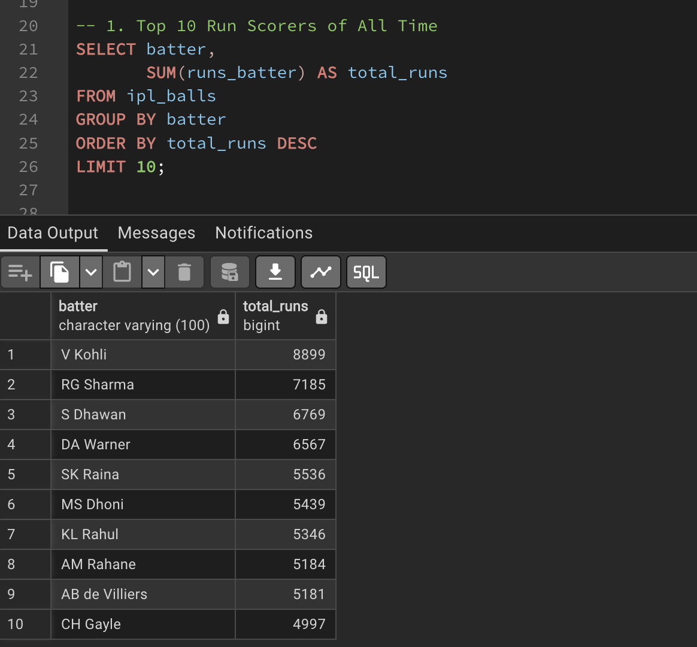
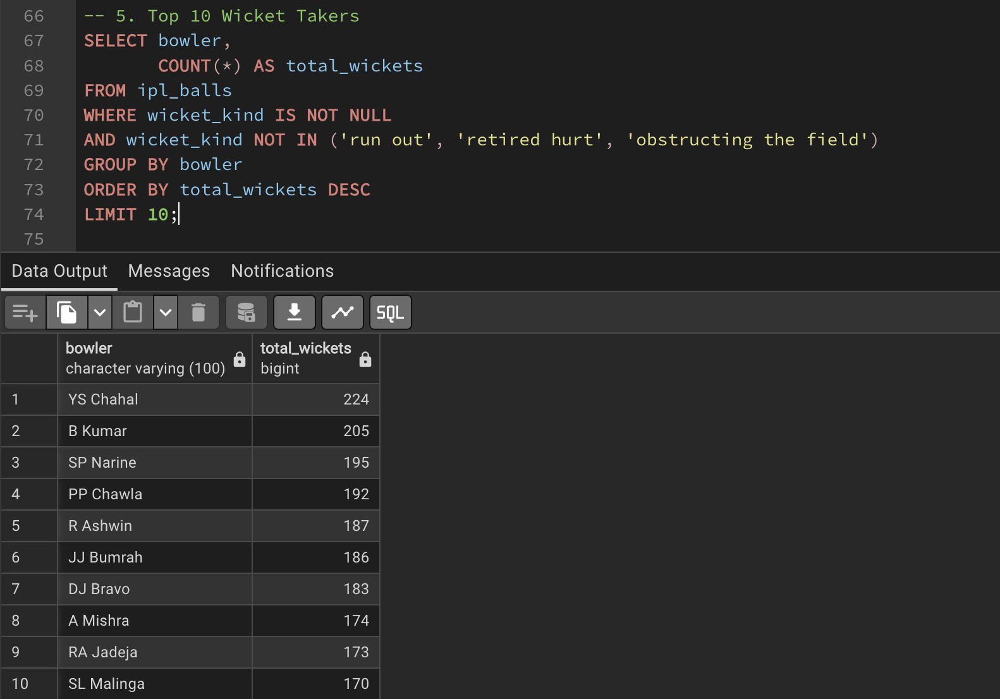
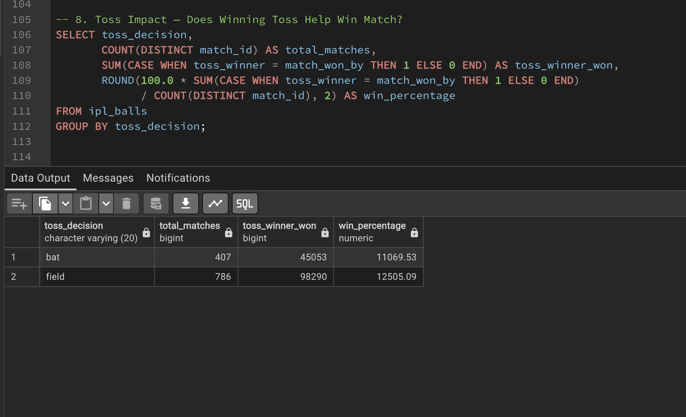

# 🏏 IPL Ball-by-Ball Analysis (2008 - 2026)

## Overview
Analyzed 283,678 ball-by-ball records from IPL matches
using PostgreSQL to uncover batting, bowling, team and player insights
across 15+ seasons of the Indian Premier League.

## Dataset
- Source: Kaggle
- Size: 283,678 rows
- Seasons: 2008 - 2023

## Tools Used
- PostgreSQL 17
- pgAdmin 4
- GitHub

## Files
- `schema.sql` — Table structure
- `ipl_analysis.sql` — All analysis queries
- `screenshots/` — Query result screenshots

## Key Questions Answered
- Who are the top 10 run scorers of all time?
- Which bowlers have the best economy rate?
- Does winning the toss affect match results?
- Who are the best death over specialists?
- Which players perform best in finals?
- Who are the best all rounders?
- Which venues favor batting or bowling?
- Who wins more — teams batting first or second?

## Sample Results

### Top 10 Run Scorers

### Top Wicket Takers

### Toss Impact

